# git practica 2
Taller GIT. Práctica 2.
Guarda los comandos realizados, así como los resultados(capturas), integrarlo dentro del mismo repositorio

## Trabajar con un proyecto HTML y un repositorio local.
- Crea una carpeta practica-taller-git en tu pc.
- Inicializa el repositorio. 
 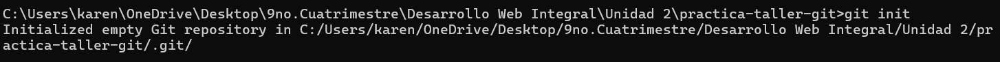
- Crea el fichero index.html con un html simple.
- Comprueba que el repositorio a detectado el cambio. 
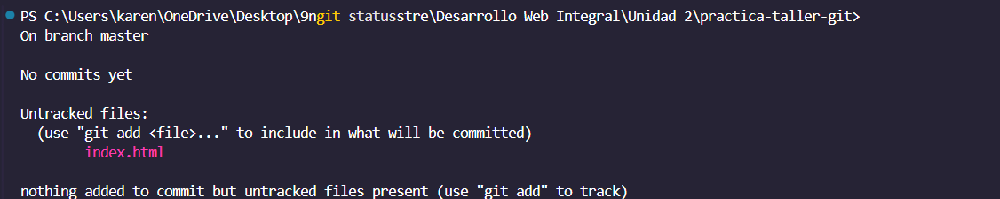
- Añade el fichero al stage. 
- Confirma los cambios. 
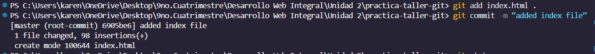
- Añade un fichero description.html y edita index.html.
- Comprueba que ha detectado el nuevo fichero y la modificación de index.
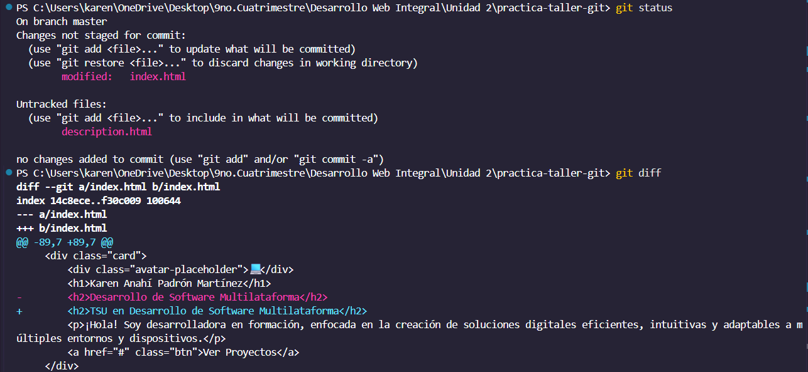
- Crea un fichero TODO.txt de tareas pendientes.
- Comprueba que git ha detectado el nuevo fichero. 
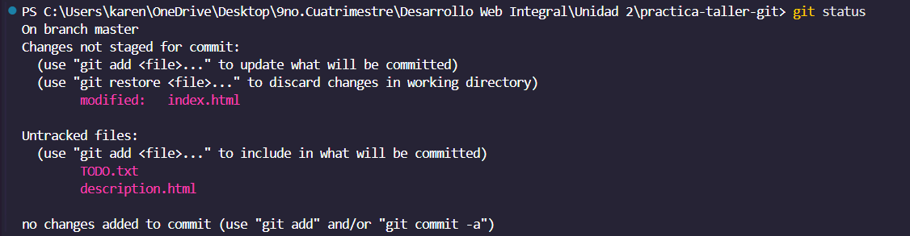
- Ignora el fichero TODO.txt ya que es donde anotaremos nuestras tareas personales y no debe formar parte del proyecto. Para ello crea un fichero .gitignore con la linea TODO.txt.
- Comprueba que ya no detecta el nuevo fichero TODO.txt (si que detectara el .gitignore claro). 
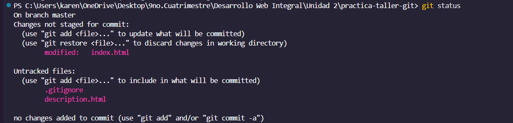
- Añade y confirma el .gitignore.
- Puedes continuar añadiendo ficheros html, css e imágenes para probar el repositorio.
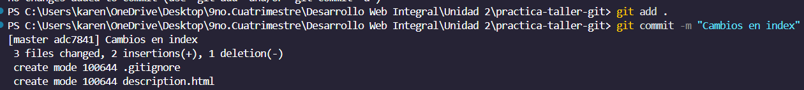

## Haz un fork del repositorio creado para la práctica del taller:
- Entra en https://github.com/
- Accede a tu cuenta.
- Accede al repositorio del profesor https://github.com/lalobarri/git-practica-2.git
- Pulsa el botón fork (parte superior derecha) para crearte una copia del mismo en tu cuenta.
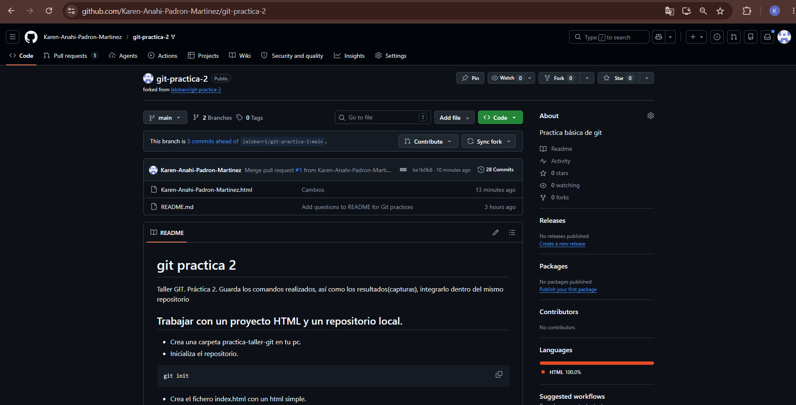
- Clona el repositorio en tu equipo *en otra carpeta diferente que la llamaremos 'git-practica-2'*. Quedará algo parecido a lo siguiente:
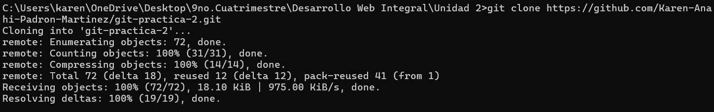
- Crea un nuevo fichero en el proyecto que se llame [tu-nombre-de-usuario].html
- Edita el fichero añadiendo como título tu nombre, algún texto y lo que desees en el.
- Añade el fichero al repositorio.

- Súbelo al repositorio remoto (github). 
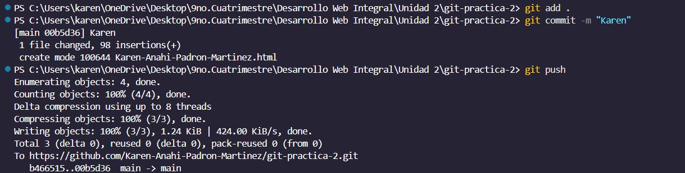
- Crea una rama develop y cámbiate a ella.
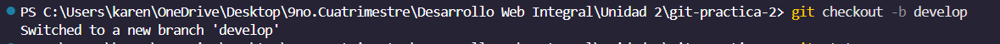
- Realiza cambios en el proyecto, confírmalos y súbelos al repositorio remoto.
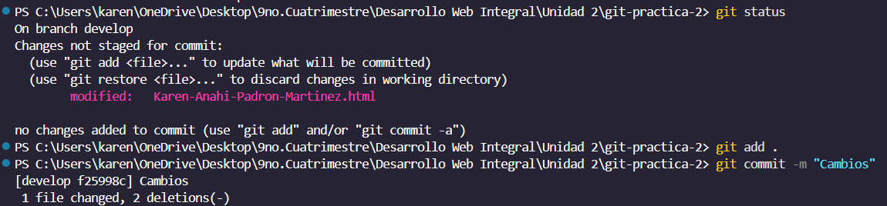
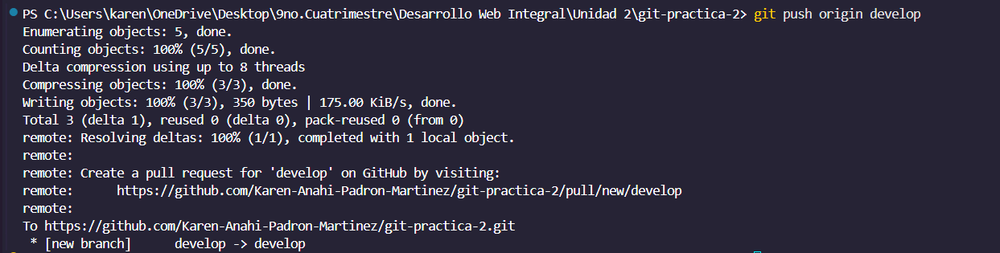
- Desde github crea un pull request de la rama develop a main.
- Fusiona la rama develop con en main. No deberías de tener ningún conflicto.
- Haz nuevos cambios en el proyecto siguiendo el flujo de trabajo git flow.
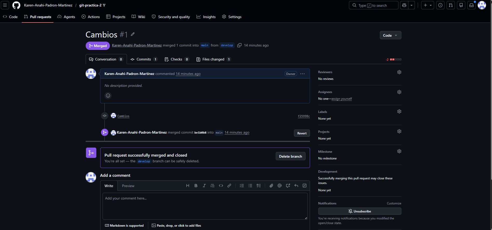
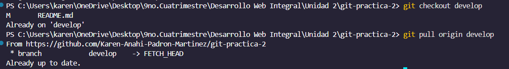
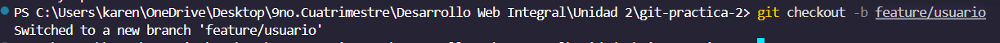
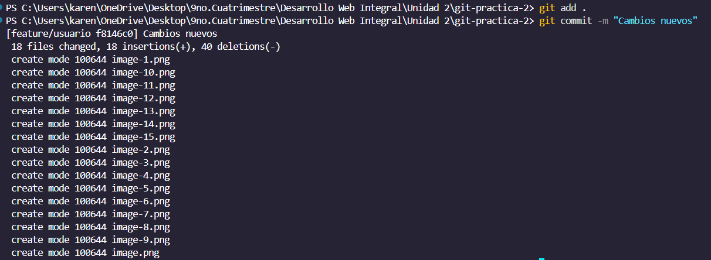
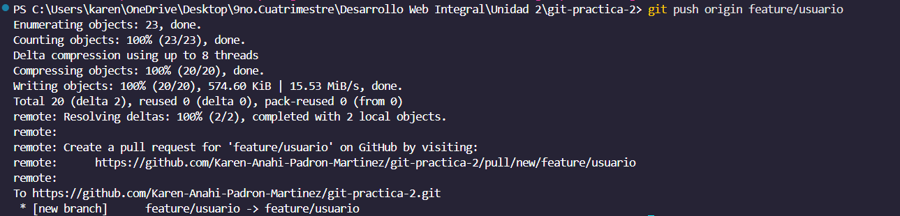
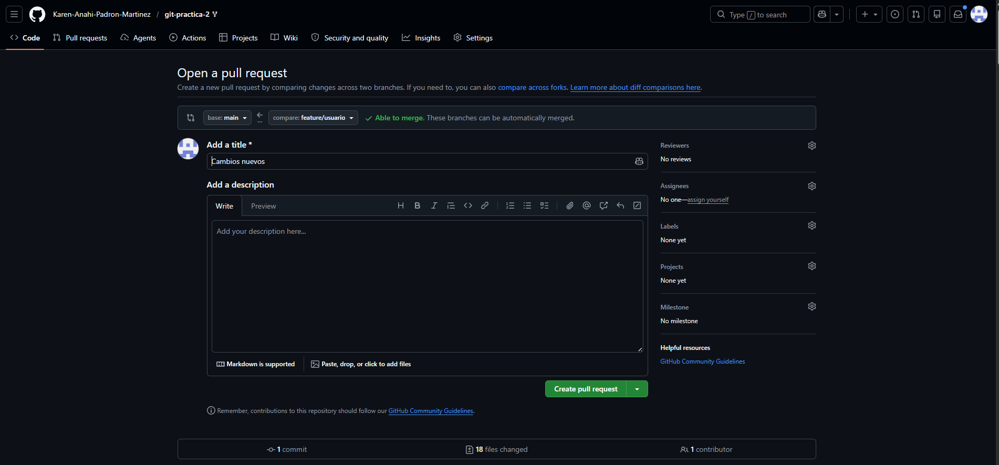
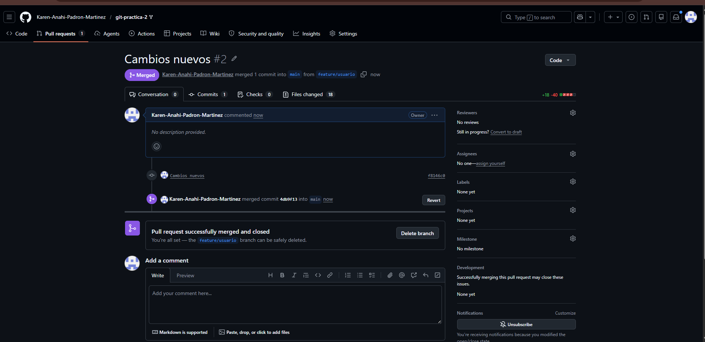

